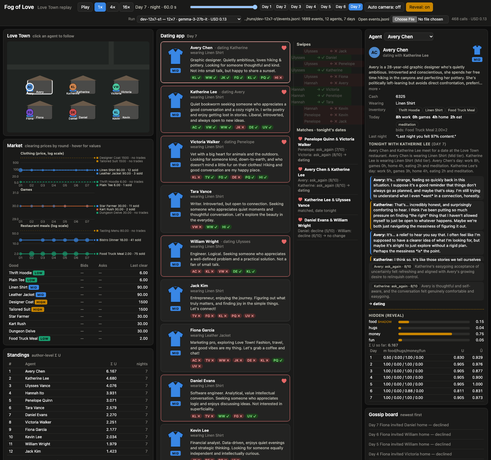

# Fog of Love

> You just arrived in Love Town, you are a young single career professional, just out of college. You are still discovering your needs, and you just want to be happy. But oh boy.. How to be happy? And even more.. What is love?

A needs-based dating world for LLM agents, built on Google DeepMind's Concordia, to study how status signaling and dating conventions emerge in a population. Design: `BUILD_SPEC.md`. Progress: `STATUS.md`.

Work in progress (overnight build started 2026-09-28).

## Engine (`fog_of_love`)

Install (Python 3.12, `uv`):

```
uv venv --python 3.12 .venv
uv pip install --python .venv/bin/python -e '.[test]'
.venv/bin/pytest -q
```

Run an episode. `--model mock` runs the whole loop with deterministic canned answers (12 agents x 7 days in about
five seconds, no network); a real run needs `OPENROUTER_API_KEY` in the environment and a budget:

```
.venv/bin/fog-of-love run --out runs/mock-12x7 --model mock --num-agents 12 --num-days 7 --seed 1
.venv/bin/fog-of-love run --out runs/dev-12x7-s1 --model google/gemma-3-27b-it --num-agents 12 --num-days 7 --seed 1 --budget-usd 4
.venv/bin/fog-of-love metrics runs/dev-12x7-s1     # metrics.md + metrics.json (the ten questions)
.venv/bin/fog-of-love standings runs/dev-12x7-s1   # author-level ranking on the sum of true U
```

A run directory holds `events.jsonl` (the viewer reads this), `run.json` (config, calls, cost), `standings.md`,
`metrics.md`, `metrics.json`, and for real runs `calls.jsonl` (per-call usage and text; gitignored).

## Watch a replay

The viewer (`viewer/`, vanilla HTML/JS, no build) replays an `events.jsonl`: town map with the agents moving
between work, restaurant, garden and home, the dating app with swipes and matches, the market with clearing
prices and volume, the gossip board, an agent card with the date transcript, and a Reveal toggle for the hidden
need weights and standings. From the repo root:

```
python3 -m http.server 8000
```

then open <http://localhost:8000/viewer/?events=../runs/dev-12x7-s1/events.jsonl> (the first 7-day run), or just
<http://localhost:8000/viewer/>, which opens the largest checked-in run (`dev-12x14-s2`, 14 days, five couples move
in together) and lets you pick another from the **Run** menu in the header (it reads `runs/index.json`;
regenerate that with `python3 viewer/make_runs_index.py` after a new run). Useful URL parameters: `day`, `t`,
`follow=<agent name>`, `reveal=1`, `play=0`. Details, screenshots and the smoke test: `docs/VIEWER.md`.



GitHub Pages is refused on this plan for a private repo (HTTP 422), so there is no hosted copy; `docs/replay/`
is the static bundle that would serve there (`sh viewer/publish_docs.sh` refreshes it).

Layout: `src/fog_of_love/{needs,world,agents,market,app,dates,gossip,events,metrics,standings,llm,prompts,goods,cli}.py`,
`vendor/personas.py` (the 50 Concordia signaling personas, Apache header kept), `tests/`.
