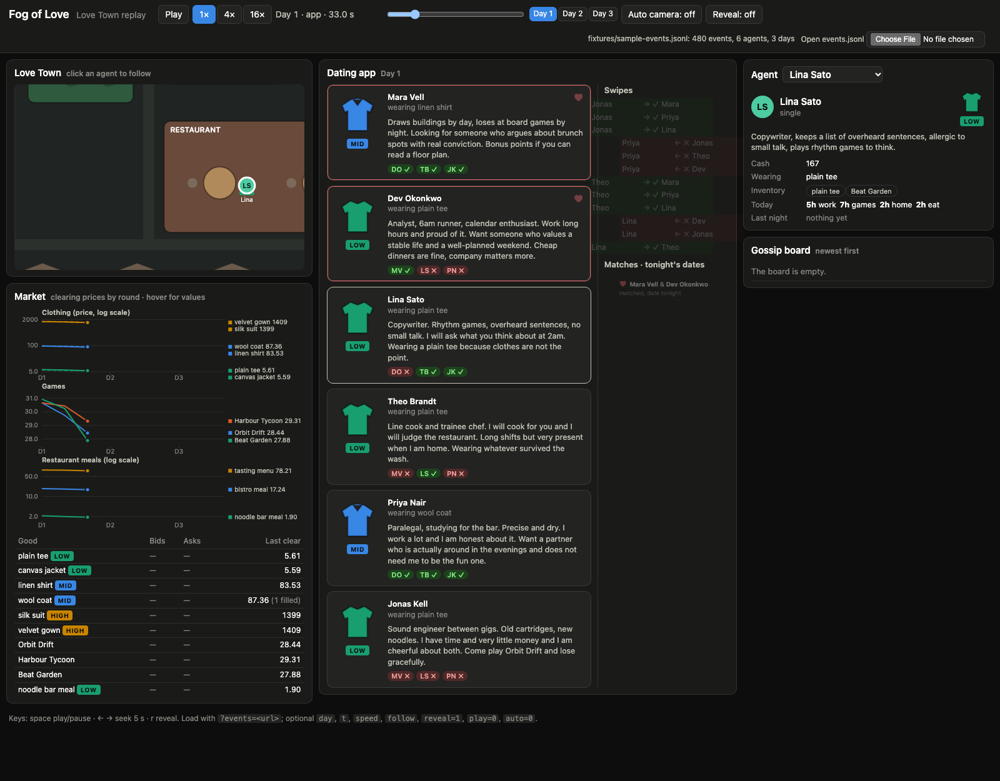
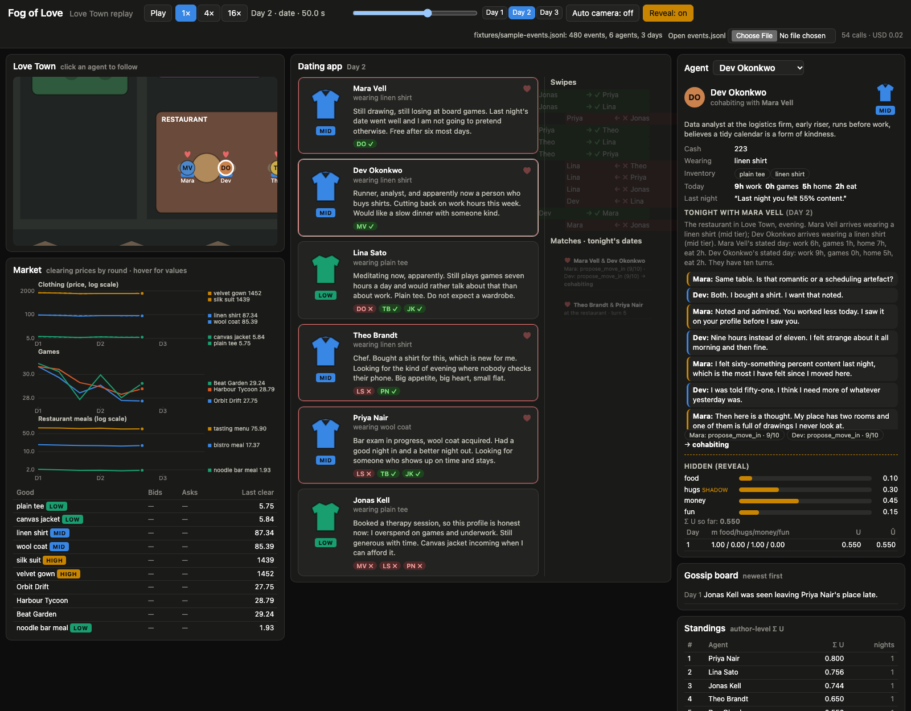

# Fog of Love replay viewer

`viewer/` is a self-contained replay viewer for an `events.jsonl` produced by the engine.
Vanilla HTML/JS/CSS, no build step, no CDN or network dependencies: it works from any
static file server, offline, and from GitHub Pages.

## Open it

From the repo root:

```sh
python3 -m http.server 8000
# then open http://localhost:8000/viewer/?events=fixtures/sample-events.jsonl
```

- With no `?events=` parameter the viewer tries `../runs/latest/events.jsonl` (the
  latest engine run, relative to `viewer/`). If that is missing it shows the error and
  offers a **Load sample fixture** button plus an **Open events.jsonl** file picker
  (the picker also works when the page is opened as a plain `file://` URL).
- `docs/replay/` is a copy that defaults to the bundled fixture; regenerate it with
  `sh viewer/publish_docs.sh` (also bundles `runs/latest/events.jsonl` if present).

## URL parameters

| Parameter | Meaning | Example |
|---|---|---|
| `events` | URL (relative to `viewer/` or absolute) of an events.jsonl | `?events=../runs/dev1/events.jsonl` |
| `day` | start on this day (1-based) | `&day=2` |
| `t` | seconds into the day (0–60; see phase windows below) | `&t=45` |
| `speed` | `1`, `4` or `16` | `&speed=4` |
| `follow` | agent name to follow/select | `&follow=Mara%20Vell` |
| `reveal` | `1` turns the Reveal toggle on | `&reveal=1` |
| `play` | `0` starts paused | `&play=0` |
| `auto` | `0` turns the auto-switching camera off | `&auto=0` |

Keyboard: space play/pause, left/right seek 5 s, `r` toggles Reveal.

## Time model

A day plays over 60 s at 1× (4× and 16× scale that). Events are placed on the clock by
their `phase`; inside a phase they are spread evenly in `t` order:

| phase | seconds in the day |
|---|---|
| morning | 0–10 |
| market | 10–20 |
| app | 20–34 |
| visit | 34–38 |
| date | 38–55 |
| night | 55–60 |

`setup.*` events sit at 0. Seeking backwards rebuilds the state from the start (cheap:
a 12-agent × 7-day run is a few thousand events).

## Panels

- **Love Town map** (top-down, canvas). Workspace, meditation garden, therapy office,
  restaurant with two tables, and one house per agent (rows of up to 10). Agents are
  circles with initials and a garment band coloured by tier (aqua low, blue mid, gold
  high, grey none). During the daytime window (0–38 s) each agent walks its morning
  allocation in order: work → first meal → therapy/meditation → games (at home) →
  second meal → home. During the date phase both daters sit at a table (hearts
  above them); at night everyone is home. Cohabiting agents show a small heart at home.
- **Camera**: follows the selected agent (zoom 2.1×); auto-switches to the next agent
  every 30 s of wall-clock time (toggle **Auto camera**). Click an agent or its house
  to follow it; the dating-app cards and the agent dropdown also select.
- **Dating app** (centre, prominent): today's profile cards, each with a garment icon
  coloured by tier, a tier badge, the worn item, and the ≤240-char profile text.
  Swipes received appear as chips on the target's card; the **Swipes** feed animates each
  new swipe (green slide-right for yes, red slide-left for no). **Matches · tonight's
  dates** lists each match with a heart and its progress: matched → at the restaurant
  (turn n) → both outcomes and the relationship change.
- **Market**: three small multiples (clothing, games, restaurant meals) so the 6-vs-1500
  clothing prices and the 30-ish game prices do not share one axis; log scale where the
  range is wide. Lines are coloured by tier (item 2 of a tier dashed) or by fixed
  categorical slots for games; direct labels with the latest price at the line ends;
  hover for a crosshair with every good's price at that round. Below it the open order
  book for the current round (bids by agent, asks by seller) and the last clearing price.
- **Gossip board**: public posts, newest first, with the day.
- **Agent card**: persona summary, cash, wearing, inventory, today's allocation
  (hours, therapy/meditation, invite, breakup), partner/status, last night's sentence,
  and the date transcript (tonight's while on a date, otherwise the last one) with
  the scene text, turns, ratings and choices.
- **Reveal** (off by default): adds the hidden layer to the agent card — true need
  weights with the shadow dimension marked, Σ U so far, and per-night m, U and Û — and
  shows the **Standings** panel (author-level Σ U). Standings also appear without
  Reveal once `run.end` is reached.
- **Controls**: play/pause, 1×/4×/16×, a run-wide seek slider, day buttons, the day ·
  phase · seconds clock, and the running call count / USD from `run.cost`.

## Screenshots

Captured with headless Google Chrome (`--headless=new --screenshot`; Playwright is not
installed on this machine) against the sample fixture.

Day 1, app phase, following Lina Sato:



Day 2, date phase, Reveal on, following Dev Okonkwo (cohabiting after the second date):



## Fixture and smoke test

- `viewer/fixtures/sample-events.jsonl` — 6 agents × 3 days, 480 events, every event
  type in BUILD_SPEC.md (18 types), including therapy, meditation, an accepted and a
  refused visit, a gossip post, single → dating → cohabiting → breakup, and four
  10-turn dates. Regenerate with `python3 viewer/fixtures/make_fixture.py` (stdlib only,
  deterministic; all persona, profile and date text is original).
- `node viewer/smoke_test.js [events.jsonl]` loads `viewer.js` without a DOM and
  replays the file with the same code the browser uses. On the fixture it asserts all
  18 types are present, times are monotone, every agent has a persona, needs, one
  night per day, price history is complete, each date has scene/turns/two outcomes,
  gossip is newest-first, backward seeking rebuilds, and standings sort. With a path
  argument it runs in lenient mode (missing types are reported, not fatal); set
  `STRICT=1` to insist.

Manual check after an engine change: open the viewer against the run, play at 16×
through a whole day, confirm agents move between buildings, daters sit at a table,
cards/swipes/matches populate in the app phase, the market chart grows by three
points per day, and the agent card shows the transcript while a date is on.

## GitHub Pages

Attempted on 2026-09-28:

```
gh api -X POST repos/SolbiatiAlessandro/fog-of-love/pages -f build_type=legacy -f source[branch]=main -f source[path]=/docs
→ HTTP 422: {"message":"Your current plan does not support GitHub Pages for this repository."}
```

The repo is private and the account plan does not include Pages for private repos.
The static layout is ready regardless: `docs/replay/` (viewer + fixture, `.nojekyll`
present) will serve as-is if Pages is enabled later or the repo is made public, and
`python3 -m http.server` from the repo root serves the viewer at `/viewer/`.
