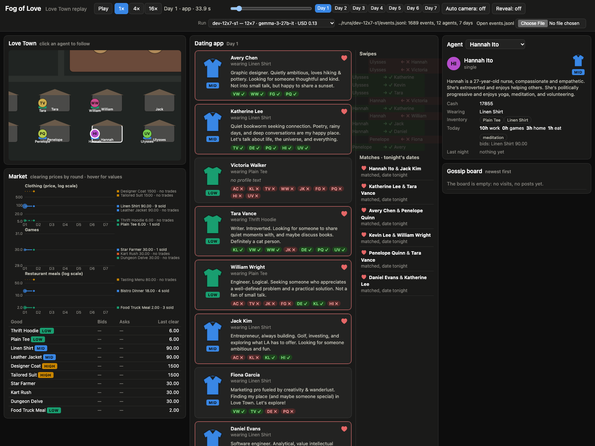
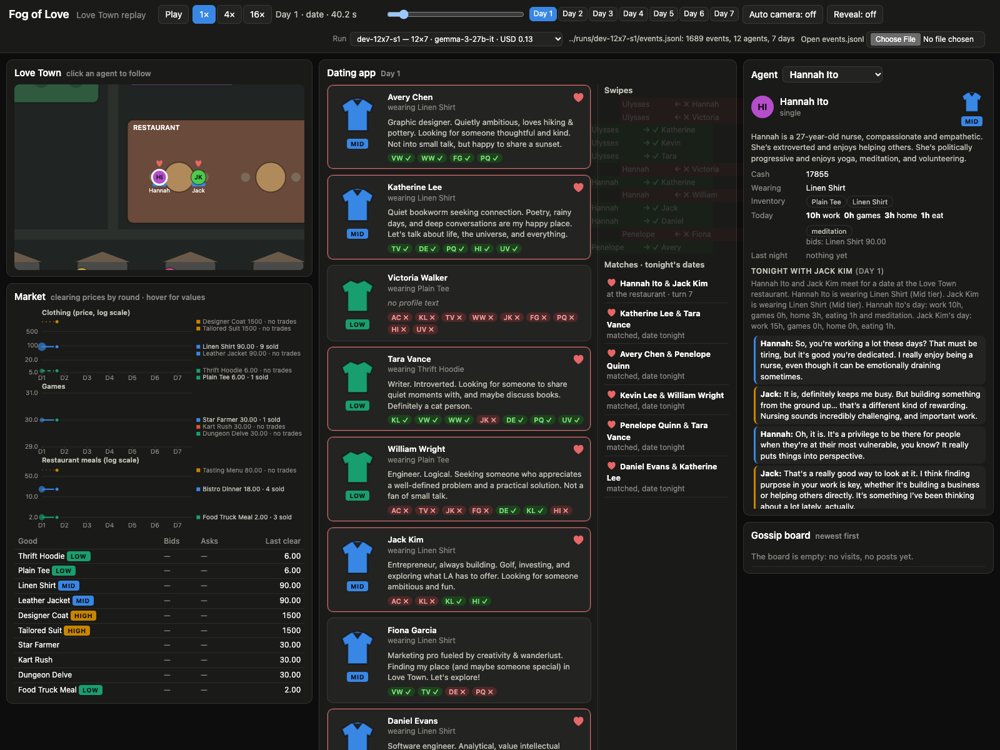

# Fog of Love replay viewer

`viewer/` is a self-contained replay viewer for an `events.jsonl` produced by the engine.
Vanilla HTML/JS/CSS, no build step, no CDN or network dependencies: it works from any
static file server and offline.

## Open it

From the repo root:

```sh
python3 -m http.server 8000
# then open
#   http://localhost:8000/viewer/?events=../runs/dev-12x7-s1/events.jsonl
# or just http://localhost:8000/viewer/ and use the Run picker in the header
```

- **Run picker** (header): lists the runs in `runs/index.json` (`name`, agents × days,
  model, USD; the `note` is the tooltip) plus the sample fixture. Switching runs rewrites
  `?events=` and restarts at day 1. Regenerate the index after a new run with
  `python3 viewer/make_runs_index.py` (stdlib; scans `runs/*/run.json`, skips
  directories without an `events.jsonl`, sorts the largest run first).
- With no `?events=` parameter the viewer loads the first entry of `runs/index.json`
  (the largest run, currently `dev-12x7-s1`); without an index it tries
  `../runs/latest/events.jsonl`. If that fails it shows the error and offers a
  **Load sample fixture** button plus an **Open events.jsonl** file picker (the picker
  also works when the page is opened as a plain `file://` URL).
- `docs/replay/` is a static copy with the indexed runs bundled next to it
  (`docs/replay/runs/<name>/events.jsonl`); it defaults to the real run and keeps the
  fixture in the picker. Regenerate with `sh viewer/publish_docs.sh`.

## URL parameters

| Parameter | Meaning | Example |
|---|---|---|
| `events` | URL (relative to `viewer/` or absolute) of an events.jsonl | `?events=../runs/dev-12x7-s1/events.jsonl` |
| `day` | start on this day (1-based) | `&day=2` |
| `t` | seconds into the day (0–60; see phase windows below) | `&t=45` |
| `speed` | `1`, `4` or `16` | `&speed=4` |
| `follow` | agent name to follow/select | `&follow=Hannah%20Ito` |
| `reveal` | `1` turns the Reveal toggle on | `&reveal=1` |
| `play` | `0` starts paused | `&play=0` |
| `auto` | `0` turns the auto-switching camera off | `&auto=0` |

Keyboard: space play/pause, left/right seek 5 s, `r` toggles Reveal.

## Time model

A day plays over 60 s at 1× (4× and 16× scale that). Events are placed on the clock by
their `phase`; inside a phase they are spread evenly in `t` order:

| phase | seconds in the day |
|---|---|
| morning | 0–10 |
| market | 10–20 |
| app | 20–34 |
| visit | 34–38 |
| date | 38–55 |
| night | 55–60 |

`setup.*` events sit at 0. Seeking backwards rebuilds the state from the start (cheap:
the 12-agent × 7-day run is 1,689 events). The run-wide seek slider spans all days
(420 s for 7 days); the day buttons jump to a day's start.

## Panels

- **Love Town map** (top-down, canvas). Workspace, meditation garden, therapy office,
  restaurant with two tables, and one house per agent in balanced rows (12 agents →
  6 + 6). Agents are circles with initials and a garment band coloured by tier (aqua
  low, blue mid, gold high, grey none). During the daytime window (0–38 s) each agent
  walks its morning allocation in order: work → first meal → therapy/meditation → games
  (at home) → second meal → home. During the date phase both daters sit at a table
  (hearts above them; a third and fourth date stack below the tables); at night everyone
  is home. Cohabiting agents show a small heart at home.
- **Camera**: opens on the followed agent (zoom 2.1×); auto-switches to the next agent
  every 30 s of wall-clock time (toggle **Auto camera**). Click an agent or its house
  to follow it; the dating-app cards and the agent dropdown also select.
- **Dating app** (centre, prominent): today's profile cards, each with a garment icon
  coloured by tier, a tier badge, the worn item, and the ≤240-char profile text. When
  the model returns no text (`app.profile.text: null`) the card shows the agent's last
  non-empty text marked "(earlier text)", or *no profile text*. Swipes received appear
  as chips on the target's card; the **Swipes** feed animates each new swipe (green
  slide-right for yes, red slide-left for no; no animation under
  `prefers-reduced-motion`). **Matches · tonight's dates** lists each match with a heart
  and its progress: matched → at the restaurant (turn n) → both outcomes and the
  relationship change; standing dates of couples already dating (no match needed) follow
  with an outline heart.
- **Market**: three small multiples (clothing, games, restaurant meals) so the 6-vs-1500
  clothing prices and the 30-ish game prices do not share one axis; log scale where the
  range is wide. Lines are coloured by tier (second item of a tier dashed) or by fixed
  categorical slots for games; dots on a line mark clearing rounds with fills, area ∝
  units sold; direct labels at the line ends give the latest price and the units sold so
  far. A good that never traded is drawn faint and dotted and labelled **no trades**: its
  "price" is only the list price carried through the clearing house. Hover for a
  crosshair with every good's price (and units sold) at that round. Below it the open
  order book for the current round (bids by agent, asks by seller) and the last clearing
  price. Works with rounds numbered from 0 (engine) or 1 (fixture).
- **Standings** (left column, under the market): author-level Σ U, shown once
  `run.end` is reached or whenever Reveal is on.
- **Gossip board**: public posts, newest first, with the day; visit invites are listed
  too (accepted/declined), so a run with invitations but no visits is not a blank panel.
- **Agent card**: persona summary (long ones clamp to four lines; click **more**),
  cash, wearing, inventory with counts, today's allocation (hours, therapy/meditation,
  invite, accepted invite, move-in, breakup, `fallback` when the model's JSON was
  unparseable) and shopping bids, partner/status, last night's sentence, and the date
  transcript (tonight's while a date is on, otherwise the last one) with the scene text,
  turns, and each side's rating, choice and stated reason.
- **Reveal** (off by default): adds the hidden layer to the agent card — true need
  weights with the shadow dimension marked, Σ U so far, and per-night m, U and Û — and
  shows the Standings panel before the run ends.
- **Controls**: play/pause, 1×/4×/16×, the run-wide seek slider, day buttons, the day ·
  phase · seconds clock, and the running call count / USD from `run.cost`.

## Screenshots

Captured with headless Google Chrome against the real run `runs/dev-12x7-s1`
(12 agents × 7 days, google/gemma-3-27b-it, USD 0.1285). Playwright is not installed on
this machine; the command, run from the repo root with `python3 -m http.server 8000` up:

```sh
"/Applications/Google Chrome.app/Contents/MacOS/Google Chrome" --headless=new --disable-gpu \
  --hide-scrollbars --force-prefers-reduced-motion --virtual-time-budget=6000 \
  --window-size=1600,1200 --screenshot=docs/viewer-real-day1-app.png \
  "http://127.0.0.1:8000/viewer/?events=../runs/dev-12x7-s1/events.jsonl&day=1&t=33.9&play=0&auto=0&follow=Hannah%20Ito"
```

Day 1, end of the app phase: 12 profiles, six matches with hearts, the swipe feed,
Hannah Ito followed on the map (`&day=1&t=33.9&follow=Hannah%20Ito`):



Day 1, date phase: Hannah Ito and Jack Kim at a restaurant table, "turn 7" in the
matches list, the transcript in the agent card (`&day=1&t=40.2&follow=Hannah%20Ito`):



Day 7, run end, Reveal on: seven days of clearing prices with sales volume (Linen
Shirt 12 sold; the High tier never traded), the Standings, Avery Chen's hidden weights
and nightly U/Û, and Fiona Garcia's four declined invitations on the board
(`&day=7&t=60&reveal=1&follow=Avery%20Chen`, window 1600×1500):


## What the real run showed in the viewer

Checked 2026-09-28 against `runs/dev-12x7-s1/events.jsonl`. Differences from the fixture
that the viewer now normalises:

- Goods come as `category: "Clothing" | "Games" | "Food"` and
  `tier: "Low" | "Mid" | "High" | "Standard"`; the fixture used lowercase singulars.
  Without normalisation every market group was empty and every badge grey.
- Market rounds are numbered from 0 (fixture: from 1); points are now placed by offset
  from the first round seen.
- `night.state.inventory` is `{item: qty}`, not a list.
- Two `app.profile` events have `text: null` (Victoria Walker, days 1–2).
- Every clearing price equals the list price (bids were placed at the ask, trades clear
  at the midpoint), so the price lines are flat and the information is in the volume:
  Food Truck Meal 75, Bistro Dinner 41, Linen Shirt 12, Star Farmer 11, Leather Jacket 3,
  Kart Rush 2, Plain Tee 1; five goods never traded (both High garments, Thrift Hoodie,
  Dungeon Delve, Tasting Menu).
- 0 `gossip.post`, 4 declined `visit.invite`, 25 `relationship.change` (all
  single ↔ dating), no cohabiting couple, no therapy. The gossip board would have been
  blank; it now lists the invites.
- Couples already dating get a standing date without a match; those now appear under
  the matches.

## Fixture and smoke test

- `viewer/fixtures/sample-events.jsonl` — 6 agents × 3 days, 480 events, every event
  type in BUILD_SPEC.md (18 types), including therapy, meditation, an accepted and a
  refused visit, a gossip post, single → dating → cohabiting → breakup, and four
  10-turn dates. Regenerate with `python3 viewer/fixtures/make_fixture.py` (stdlib only,
  deterministic; all persona, profile and date text is original).
- `node viewer/smoke_test.js [events.jsonl]` loads `viewer.js` without a DOM and
  replays the file with the same code the browser uses. It asserts times are monotone,
  every agent has a persona, needs, one night per day, an `{item: qty}` inventory, goods
  are normalised, profile texts are non-empty strings or null, price history is
  complete, each date has scene/turns/two outcomes, gossip is newest-first, backward
  seeking rebuilds, and standings sort. Without a path argument it runs on the fixture
  and requires all 18 types. With a path it runs in lenient mode; `STRICT=1` requires
  `run.end`, needs, and the event types every run must have (`setup.world`,
  `setup.needs`, `morning.allocation`, `market.*`, `app.profile`, `app.swipe`,
  `night.state`, `run.cost`, `run.end`). Types a real run can legitimately lack
  (`gossip.post`, `visit.invite`, `relationship.change`, `app.match`, `date.*`) only
  produce a warning:

  ```
  STRICT=1 node viewer/smoke_test.js runs/dev-12x7-s1/events.jsonl
  warning: no gossip.post events in this run (allowed; the panels that depend on them stay empty)
  OK runs/dev-12x7-s1/events.jsonl: 1689 events, 12 agents, 7 days, ... 145 units sold (5 goods never traded), 17/18 event types
  ```

Manual check after an engine change: open the viewer against the run, play at 16×
through a whole day, confirm agents move between buildings, daters sit at a table,
cards/swipes/matches populate in the app phase, the market chart grows by three
points per day, and the agent card shows the transcript while a date is on.

## GitHub Pages

Attempted on 2026-09-28 and refused by the plan:

```
gh api -X POST repos/SolbiatiAlessandro/fog-of-love/pages -f build_type=legacy -f source[branch]=main -f source[path]=/docs
→ HTTP 422: {"message":"Your current plan does not support GitHub Pages for this repository."}
```

The repo is private and the account plan does not include Pages for private repos, so
there is no hosted replay. The static layout is ready regardless: `docs/replay/`
(viewer, fixture, bundled runs, `docs/.nojekyll`) will serve as-is if Pages is enabled
later or the repo is made public.

To view locally, from the repo root:

```sh
python3 -m http.server 8000
# live viewer against the checked-in runs:
open "http://localhost:8000/viewer/?events=../runs/dev-12x7-s1/events.jsonl"
# the static copy that Pages would serve:
open "http://localhost:8000/docs/replay/"
```
